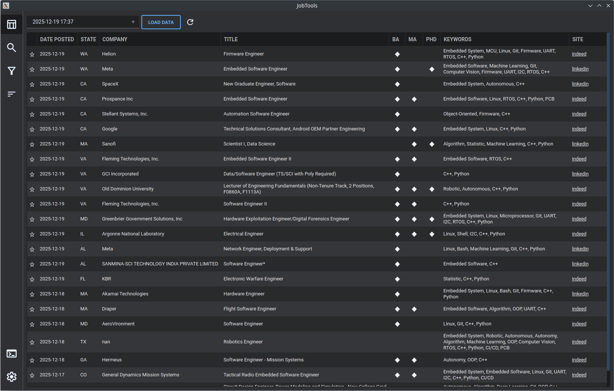
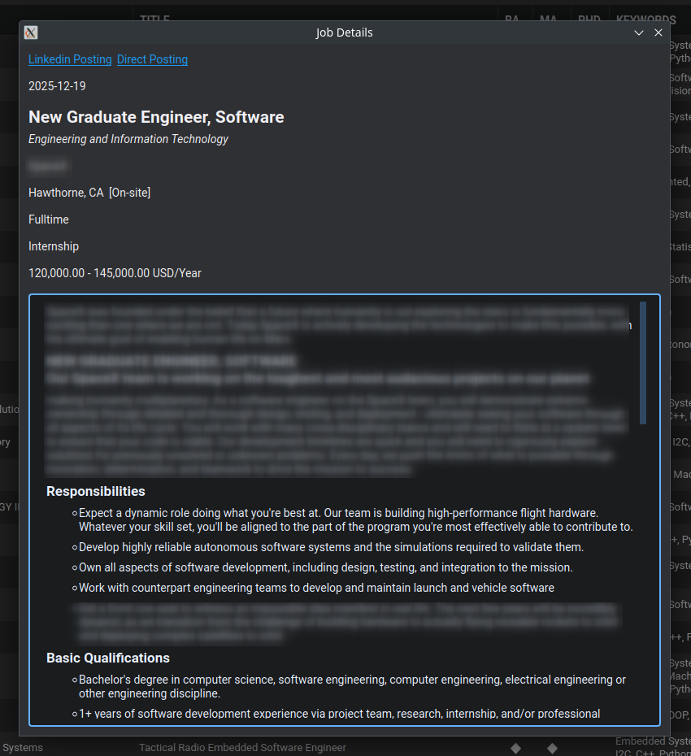
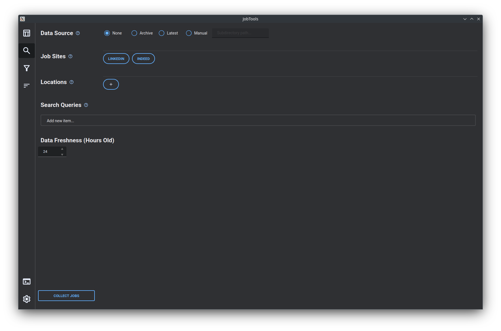
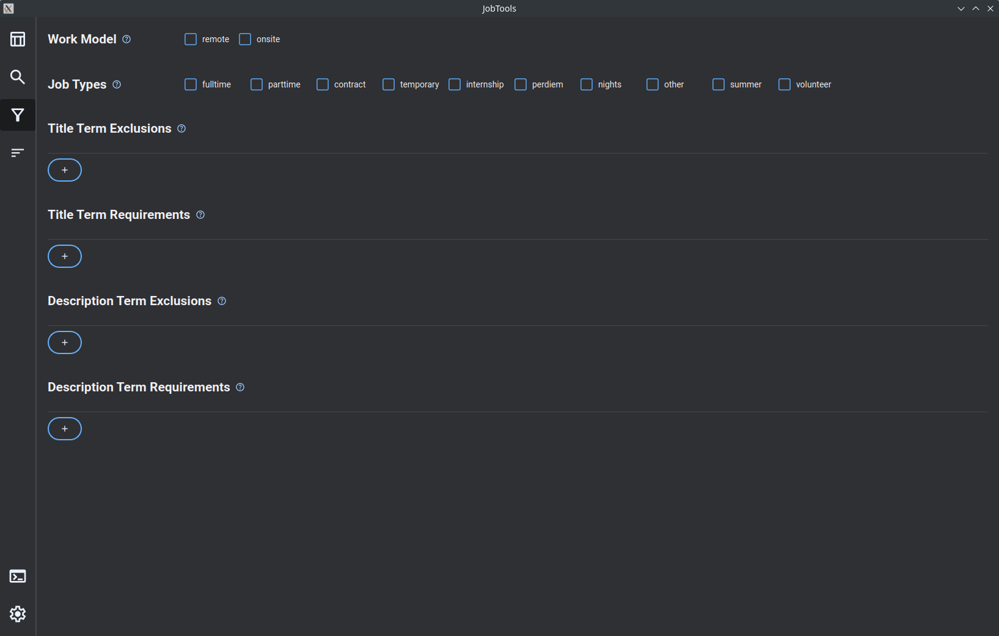
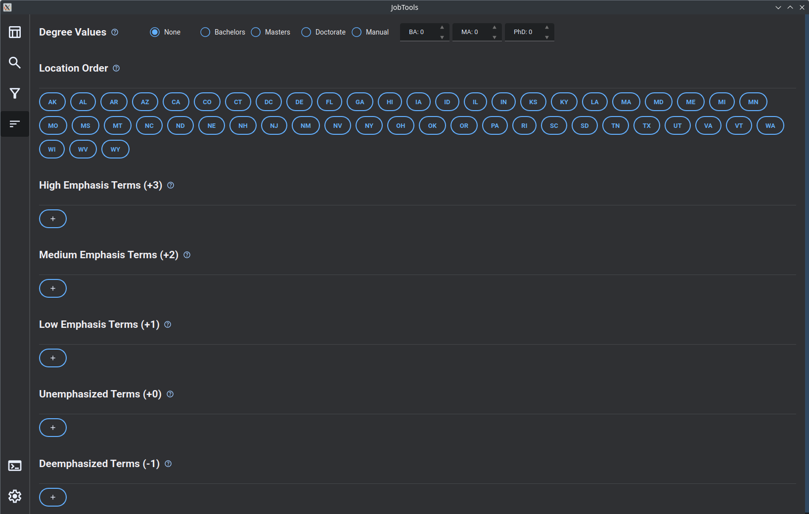
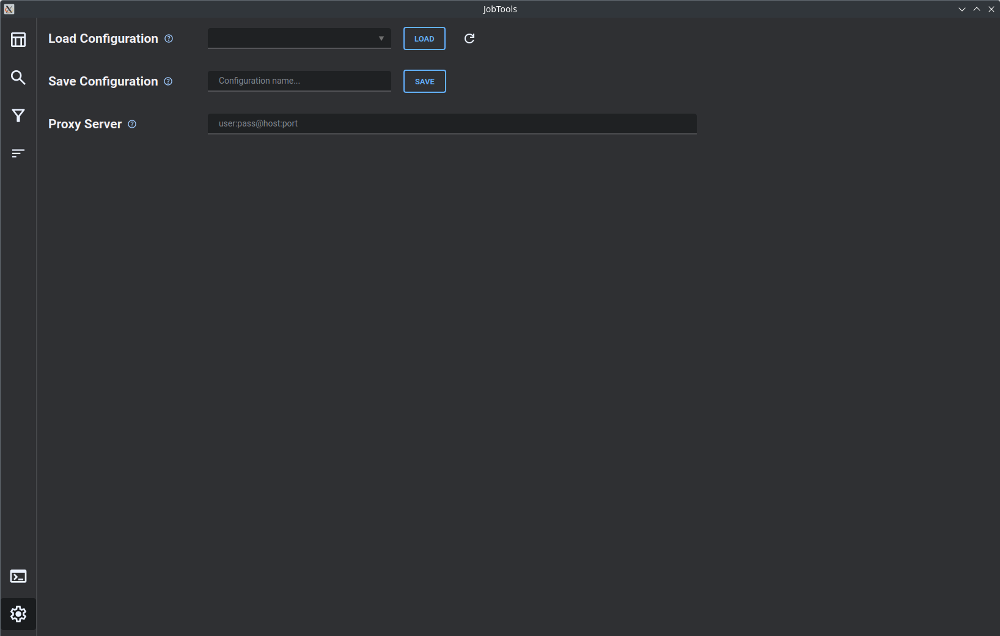

# JobTools

**JobTools** is a privacy-focused desktop application to boost your job search. Built around the [**JobSpy**](https://github.com/speedyapply/JobSpy) job scraping library, JobTools makes finding your next role easier with a sleek GUI and a growing suite of tools to manage your leads.

---

# Features

|                                                     |                                                     |
| --------------------------------------------------- | --------------------------------------------------- |
|           | <h3>Jobs Data</h3><br><ul><li>Load data from past collection runs, your favorites, or a full archive of collected data</li><li>Add jobs to your favorites directly from the table</li><li>Click a listing's job title to view full job details</li><li>Click a listing's company to view full company details</li></ul> |
|          | <h3>Job Details</h3><br><ul><li>Link to job-board posting, and link to direct company posting when available</li><li>Date posted, title, company, location, and work model</li><li>Job function, type, level, and compensation when available</li><li>Full formatted job description</li></ul> |
|  | <h3>Company Details</h3><br><ul><li>Link to company page on the job-board, and link to company website when available</li><li>Company logo and name</li><li>Industry, description, headcount, and revenue when available</li><li>Company addresses and other contact details</li></ul> |
|          | <h3>Collection</h3><br><ul><li>Specify the maximum time since jobs were posted</li><li>Specify multiple job sites, geographical locations, and search queries</li><li>Run all permutations of site, location, and query in a single click</li></ul> |
|          | <h3>Filtering</h3><br><ul><li>Select which work models and job types to include in results</li><li>Specify requisite and backlist terms for job titles and descriptions</li><li>Apply filters in real time to the active dataset</li></ul> |
|           | <h3>Sorting</h3><br><ul><li>Apply weight to degree levels (BA/MA/PhD) mentioned in postings</li><li>Set location priority order (currently only supports US states)</li><li>Specify sets of terms at multiple weights levels to adjust job priority by term presence</li><li>View ordering of the active dataset in real time based on selections</li></ul> |
|      | <h3>Settings</h3><br><ul><li>Support for scraping through a proxy</li><li>Save your current configuration with a custom name</li><li>Load saved configurations</li></ul> |

---

# Binary Release

Pre-release v1.0.0 beta is available [here](https://github.com/zachramsey/jobtools/releases/tag/v1-beta).

*Feedback, suggestions, and bug reports are welcomed and appreciated!*

# Install From Source

> ***Requires Python version 3.12+***

## Get a local copy of the repository

```bash
# Clone the repository with git
git clone https://github.com/zachramsey/jobtools.git
cd jobtools
```

\~*OR*\~

> Download and extract repository [ZIP File](https://github.com/zachramsey/JobSpy/archive/refs/heads/main.zip)  
> Open extracted directory in a terminal

## Setup Environment and Run The Application

### *Option 1: Using uv (Recommended)*

```bash
# Run the application directly
uv run main.py
```

\~*OR*\~

```bash
# Explicitly sync the environment
uv sync

# Activate the venv
source .venv/bin/activate   # For macOS/Linux
.venv\Scripts\activate.bat  # For Windows (Command Prompt)
.venv\Scripts\Activate.ps1  # For Windows (PowerShell)

# Run the application
python main.py
```

### *Option 2: Using pip and venv*

```bash
# Create a virtual environment
python -m venv .venv

# Activate the venv
source .venv/bin/activate   # For macOS/Linux
.venv\Scripts\activate.bat  # For Windows (Command Prompt)
.venv\Scripts\Activate.ps1  # For Windows (PowerShell)

# Install dependencies
pip install -r requirements.txt

# Run the application
python main.py
```

### *Option 3: Using Poetry*

```bash
# Initialize and import dependencies
poetry init --no-interaction
poetry add $(cat requirements.txt)

# Install and run
poetry install
poetry run python main.py
```

### *Option 4: Using Conda / Mamba*

```bash
# Create a new environment
conda create -n jobtools python=3.12
conda activate jobtools

# Install dependencies via pip
pip install -r requirements.txt
```
